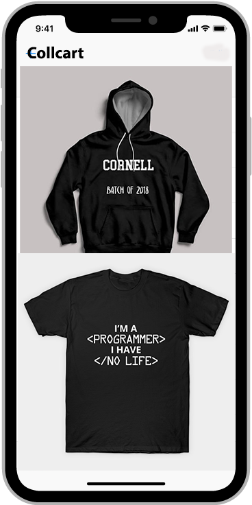

# Collcart (College based ecommerce)



## Table of Content

- [About](#about)
- [Goals](#goals)
- [Folder structure](#folder-structure)
- [Installation](#installation)

## About

Explore new and trendy getups & webseries with Collcart!!

## Goals

- [X] Migrate to React.js

## Folder structure

```
collcart
│   README.md
│   ...
└───public
│   │
│   └───images (assets)
│       │   ...
└───src
    │   
    └───assets (svg)
    │   
    └───components (components and pages)
    │   
    └───config (firebase settings)
    │   
    └───styles (global styles)
    |
    |  App.js
    |  index.js
```

## Installation can be done through

1. Prerequisites

[nodejs](https://nodejs.org)
[yarn](https://yarnpkg.com)

2. Clone the project

`git clone https://github.com/<username>/<project>`

3. Initialize the app

`npm run install` (for nodejs)

or

`yarn` (for yarn)

4. Start the app

`npm run start` (for nodejs)

or

`yarn start` (for yarn)

------

[LICENSE](./LICENSE)
